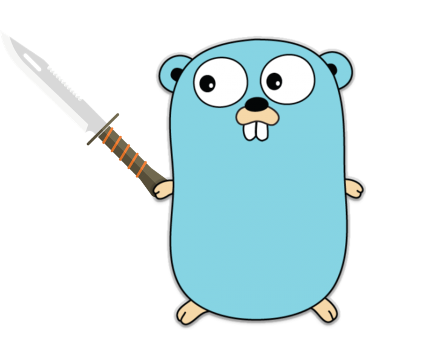
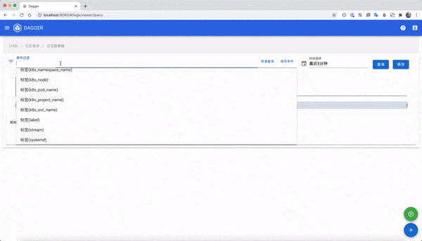

## [README of Chinese/中文文档](https://github.com/CloudmindsRobot/dagger/blob/main/README.md)

# Dagger - A Log management system based on loki

Dagger is a Cloud Native log query and management system based on Grafana Loki.

It's developed by Cloudminds Inc Cloud team, evolved from Cloudminds Devops platform "DaYu", and it has been used in production environment for more than half a year in Cloudminds.

Dagger runs on the top of Grafana Loki as the web user interface, which provides multiple containers log query(mutiple labels supported), search(regex supported) and download(mutiple containers) functions.

Dagger is made for Kubernetes and docker mutiple containers log query requirement. It's a Cloud Native log management production. The main advantage of Dagger is that it's really light weighted, easy to use and dev-friendly.

Dagger frontend is developed with vue.js, designed by vuetify ui framework. Axios framework is used for async data transfer between frontend and backend.
Dagger backend is developed with go gin framework, as gorm is used for data framework, sqlite for metadata database and go websocket for realtime data process.

A quick start for local deployment: [Quick Start](#jump)

# ScreenShots

# Features

- **Manage mutiple Grafana Loki Instances**

  - Simply log query,no complicated LogQL syntax
  - private query history per users
  - log snapshot for results ,and free download
  - real time log stream

# RoadMap

- **Log Alert**

  - Support log rules add/edit/save/apply on dagger
  - Compatible with AlertManager API, accepts alarm event push from Loki Ruler
  - Log event aggregation, analysis, and alerting
  - Support mail, aliyun(sms/voice) notifications

# Usage

Full demo vedio:（[youtube](https://youtu.be/1qc8_nZA_dM)、[bilibili](https://www.bilibili.com/video/BV1Jr4y1w7qz/)）

# Deployment

- [Quick Start](docs/quick_start.md)
  - [Log collection client Fluentd config](docs/fluentd_config.md)
  - Log collection client Promtail config
  - [Loki suggestions](docs/Loki_best_practice.md)

* Distributed Deployment

# 1.0 upgrade to 2.0

- [1.0 upgrade to 2.0](https://github.com/CloudmindsRobot/dagger/releases/tag/2.0.1-alpha)

# Release Notes

- [release history](https://github.com/CloudmindsRobot/dagger/releases)

# Q&A

# Support

You can scan this Wechat qrcode blew to follow our Wechat account and reply "Dagger" to join our discussion group

