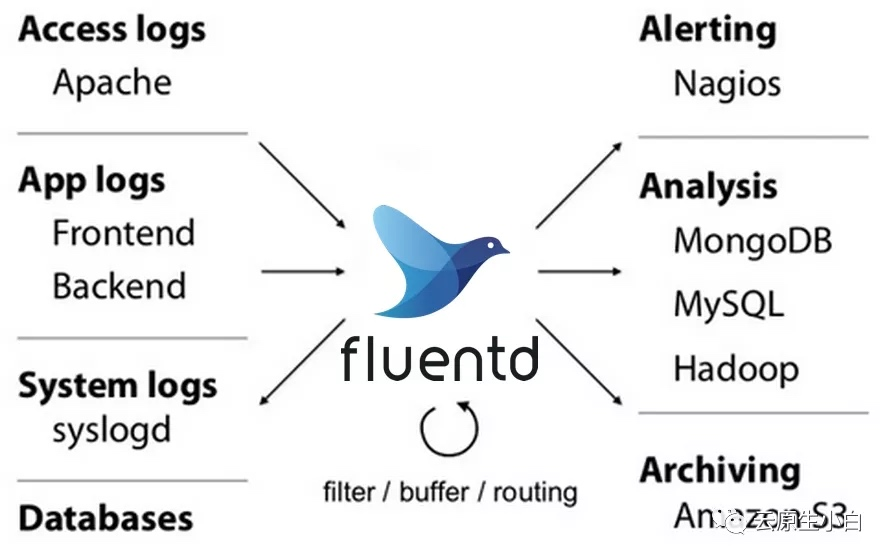
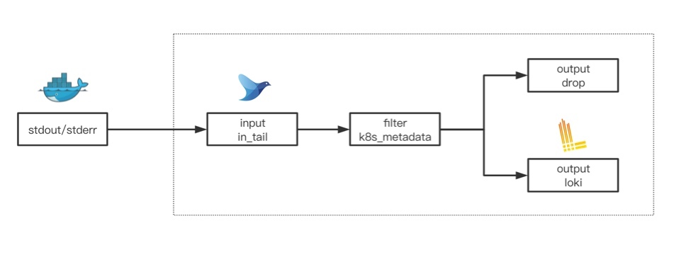

# 日志客户端Fluentd配置

[TOC]

## 为什么是Fluentd

Dagger的日志来源于Loki，所以日志客户端在Kubernetes内采集的日志质量直接影响到dagger的用户体验。Fluentd是一个由云原生基金会(CNCF)管理的统一日志层数据收集器，作为第六个从CNCF里面毕业的项目，Fluentd拥有大量的数据处理插件和生产环境的实践指导，同时还有GKE和AWS这样公有云大厂应用为其背书，所以我们推荐Fluentd作为k8s的默认日志采集器。


## Fluentd插件

Loki为fluetnd提供了一个输出插件`fluent-plugin-grafana-loki`，它可以将采集到的日志传送到Loki实例当中。当然，在实际的应用当中，还需需要我们自己去构建fluentd的docker镜像， 那么我们需要将下面几行加入到自己的dockerfile里面

```
# 必要的loki输出插件和kubernetes元数据插件
gem install fluent-plugin-grafana-loki
gem install fluent-plugin-kubernetes_metadata_filter
gem install fluent-plugin-record-modifier 
gem install fluent-plugin-rewrite-tag-filter 
```

## 日志采集结构



### Input阶段

在采集阶段， 利用fluentd的in_tail插件对docker标准输出采集即可，参照如下：

```
<worker 0>
  <source>
    @type tail
    @id input.containers.out
    path /var/log/containers/*.log
    exclude_path ["/var/log/containers/*fluentd*.log"]
    pos_file /var/log/fluentd/container.out.pos
    limit_recently_modified 86400
    read_from_head true
    tag kubernetes.*
    <parse>
      @type json
      time_key time
      time_format %Y-%m-%dT%H:%M:%S.%NZ
      utc true
    </parse>
  </source>
</worker>
```

###  Filter阶段

Filter阶段主要用来处理日志采集之后的kubernetes元数据标注以及修改、提取自定义字段,这里面主要用了两个插件`fluent-plugin-kubernetes_metadata_filter`和`fluent-plugin-record-modifier`来处理以上逻辑。

**kubernetes_metadata**主要作用为提取tag中的关键信息来向kubernetes查询Pod和Namespace上的Label，并将其添加到日志的json结构体内，它的配置可参照如下：

```yaml
<filter kubernetes.var.log.containers.**>
  @type kubernetes_metadata
  @id kubernetes_metadata_container_out
  skip_container_metadata true
  skip_master_url true
  cache_size 3000
  cache_ttl 1800   
</filter>
```
> metadata插件有Cache的机制，大家根据自己集群的规模合理调整cache的容量和cache的过期时间。正常情况下，metadata插件会watch k8s api来更新cache，如果出现新部署的容器日志没有相关标签，那么你可能需要`再等一会`或者`重启fluentd客户端`可以解决

**record_modifier**主要用于提取和修改kubernetes元数据标签，修改成我们自定义的字段，这些字段可以为后面存储在Loki的里面的Label提前建立好索引规则。这部分可参考下列配置：

```yaml
<match kubernetes.var.log.containers.**>
  @type record_modifier
  @id label.container.out
  tag ${record.dig('k8s_std_collect') ? 'loki.kubernetes.var.log.containers' : 'dropped.var.log.containers'}
  <record>
    k8s_container_id ${record.dig("docker", "container_id")}
    k8s_cloud_cluster "#{ENV['CLOUD_CLUSTER'] || 'default'}"
    k8s_node ${record.dig('kubernetes', 'host')}
    k8s_container_name ${record.dig('kubernetes', 'container_name')}
    k8s_app_name ${record.dig('kubernetes', 'labels', 'app_kubernetes_io/name')}
    k8s_svc_name ${record.dig('kubernetes', 'labels', 'app')}
    k8s_pod_name ${record.dig('kubernetes', 'pod_name')}
    k8s_namespace_name ${record.dig('kubernetes', 'namespace_name')}
    k8s_image_version ${record.dig('kubernetes', 'labels', 'app_image_version')}
    k8s_std_collect ${record.dig("kubernetes", "labels", "log-collect") or false}
    formated_time "${Time.at(time).to_datetime.iso8601(9)}"
    fluentd_worker "#{worker_id}"
  </record>
  remove_keys docker,kubernetes   //删除原生metadata字段
</match>
```
大部分情况下，我们对运行在kubernetes里面的workerload都有自己特定的labels规范，并且这部分内容`通常被CD系统集成在发布模板当中`。这里大家可以按照自己公司情况构建日志索引结构，当然你可以参考我们推荐定的label规范:
```
...
metadata:
   labels:
    app: <componet_name>   //组件名
    app.kubernetes.io/name: <app_name>   //应用名
    app.kubernetes.io/version: <app_release>  //应用版本
spec:  
  template:
    metadata:
      labels:
        app: <componet_name>
        app.image.version: <componet_image_tag>
        app.kubernetes.io/name: <app_name>
        log-collect: "true"   //日志采集开关
...
```
> 注意：`log-collect`可以灵活控制容器是否需要做日志采集，如果不需要控制，可以忽略此标签，同时还需修改record_modifier中的tag处理逻辑如下
```
tag loki.kubernetes.var.log.containers
```

### Output阶段

在此阶段，基本上由fluentd采集的日志已经完成了索引构建，我们只需匹配相关的tag将其转发指定的上游数据服务即可，这里我们当然用`fluent-plugin-grafana-loki`插件将日志抓发给Loki存储。

`loki`插件提供了比较丰富label和buffer参数调试，这里关于Loki的label可以直接采用按照前面自定义规则里面的标签即可，参照如下：

```yaml
<match loki.**>
  @type loki
  @id loki.output
  url "http://loki:3100"
  remove_keys topic,k8s_std_collect,formated_time,k8s_container_id
  drop_single_key true
  <label>
    stream
    k8s_cloud_cluster
    k8s_container_name
    k8s_node
    k8s_app_name
    k8s_svc_name
    k8s_pod_name
    k8s_image_version
    k8s_namespace_name
 </label>
  <buffer label>
    @type file
    path /var/log/fluentd-buffers/loki.buffer
    flush_mode interval
    flush_thread_count 4
    flush_interval 3s
    retry_type exponential_backoff
    retry_wait 2s
    retry_max_interval 60s
    retry_timeout 12h
    chunk_limit_size 8M
    total_limit_size 5G
    queued_chunks_limit_size 64
    overflow_action drop_oldest_chunk
  </buffer>
</match>
```