# Quick Start

[TOC]

## 一、部署说明

### 开始之前

如前所述，Dagger 是工作在 [Loki](https://github.com/grafana/loki) 基础之上的，因此要使用 Dagger，要满足以下条件：

#### Kubernetes 方式

1. 有一个可用的 Kubernetes 环境，并可以获取公网镜像（也可以用其它方式使用私有镜像库、或者直接使用本地镜像），。

1. 部署安装了完整的 Loki，包括日志采集端和 Loki 服务。

例如使用 Helm 3 快速启动 Loki：

```command
helm repo add loki https://grafana.github.io/loki/charts
# helm install loki loki/loki  \
    --set persistence.enabled=true \
    --set replicas=2 \
    --set fullnameOverride=loki

# helm install fluent-bit loki/fluent-bit \
  --set loki.serviceName=loki \
  --set config.batchSize=10240 \
  --set fullnameOverride=fluent-bit
```

然后获取项目源码：`git clone https://github.com/CloudmindsRobot/dagger.git`

### Kubernetes

进入源码目录，编辑 `production/kubernetes/dagger-kubernetes-install.yaml` 文件中的环境变量，指向 Loki 服务，例如：

```yaml
- name: LOKI_SERVER
  value: http://loki:3100
```

如果测试集群没有自动提供 PVC 的能力，也需要将 PVC 部分做一下修改。

使用 `kubectl apply -f dagger-kubernetes-install.yaml`，等 Pod 全部运行成功，就可以进行后续步骤了。

### Docker-Compose

- 进入源码目录，编辑 `docker-compose.yaml` 文件

```yaml
version: '3.8'
services:
  ui:
    build:
      context: ..
      dockerfile: ./build-image/Dockerfile.ui
      target: ui
    image: quay.io/cloudminds/dagger-ui:latest
    hostname: dagger-ui
    container_name: dagger-ui
    ports:
      - '8080:8080'
    networks:
      - dagger
    restart: on-failure
  backend:
    build:
      context: ..
      dockerfile: ./build-image/Dockerfile.backend
      target: backend
    image: quay.io/cloudminds/dagger-backend:latest
    hostname: dagger-backend
    container_name: dagger-backend
    depends_on:
      - mysql
      - alertmanager
    ports:
      - '8000:8000'
    command: ['sh', '-c', './dagger']
    networks:
      - dagger
    volumes:
      - '../backend/dagger.ini:/etc/dagger/dagger.ini'
      - 'static_data:/usr/src/app/static:rw'
      - 'alertmanager_conf:/usr/src/app/conf:rw'
    restart: on-failure
  alertmanager:
    image: prom/alertmanager:v0.21.0
    hostname: dagger-alertmanager
    container_name: dagger-alertmanager
    ports:
      - '9093:9093'
    networks:
      - dagger
    volumes:
      - 'alertmanager_conf:/etc/alertmanager:rw'
  mysql:
    image: mysql:5.7
    hostname: dagger-mysql
    container_name: dagger-mysql
    environment:
      MYSQL_ROOT_PASSWORD: 123456
      MYSQL_DATABASE: log
    ports:
      - '3306:3306'
    networks:
      - dagger
    volumes:
      - './config:/docker-entrypoint-initdb.d:rw'

volumes:
  sqlite_data:
    driver: local
  static_data:
    driver: local
  alertmanager_conf:
    driver: local

networks:
  dagger:
    driver: bridge
```

- 编辑 `dagger.ini` 文件

```
[global]
debug = true
; 邮件接收者，仅当未开启用户注册时生效
to =
; 是否需要告警模块
alert_enabled = true

[users]
; 允许注册
allow_sign_up = true
admin_username = admin
admin_passwod = admin

[db]
address = root:123456@tcp(dagger-mysql:3306)/log?charset=utf8&parseTime=True&loc=Local

[loki]
address = http://172.16.31.102:3100

[ldap]
enabled = false
ldap_host = 172.1.1.1
ldap_port = 389
ldap_base_dn =
ldap_bind_username =
ldap_bind_password =
ldap_username_key = uid
ldap_mail_key = mail

[alertmanager]
; 同alertmanager.yml配置
enabled = true
address = http://dagger-alertmanager:9093
smtp_from =
smtp_smarthost =
smtp_smartport = 25
smtp_auth_username =
smtp_auth_password =
```

- 启动服务

```
$ docker-compose -f production/docker-compose.yaml up -d
```

### 宿主机直接运行

- 复制 `dagger.ini` 文件至 `/etc/dagger/` 目录下

- 编译后端

```
CGO_ENABLED=0 GOOS=linux GOARCH=amd64 go build -o dagger backend/main.go 或者直接使用二进制文件启动 ./dagger
```

- 复制 `dagger` 至 `/usr/local/bin/` 目录下，可采用 `nohup` 或 `systemd` 方式启动后端

- 编译前端

```
yarn install && yarn build
```

- 将生成的 `dist` 文件下复制到本地路径下， 例如 `/usr/src/`
  修改 `deploy/ng-dagger.conf` 中 location / 下 `root /usr/src/app/dist/;` 为刚刚复制路径，
  将`deploy/ng-dagger.conf`复制到`/etc/nginx/conf.d/ng-dagger.conf`

- 重启 `nginx`

### Helm

更新中...

## 二、使用说明

### 主界面

初始化部署完成后第一次登陆使用默认管理员账号密码，参考 `dagger.ini` 文件，如需注册新用户，请将 `allow_sign_up` 配置打开，按照指示注册即可。支持 `ldap` 登陆。
注：用户名、密码和邮箱都是必填的

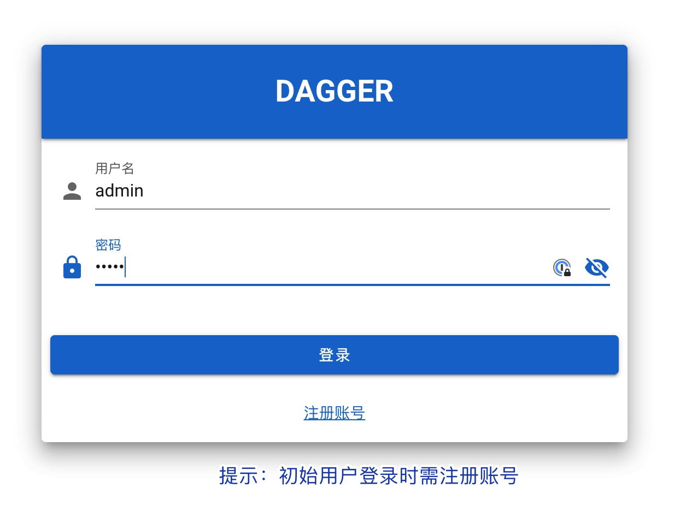

登陆 Dagger 后主界面如下

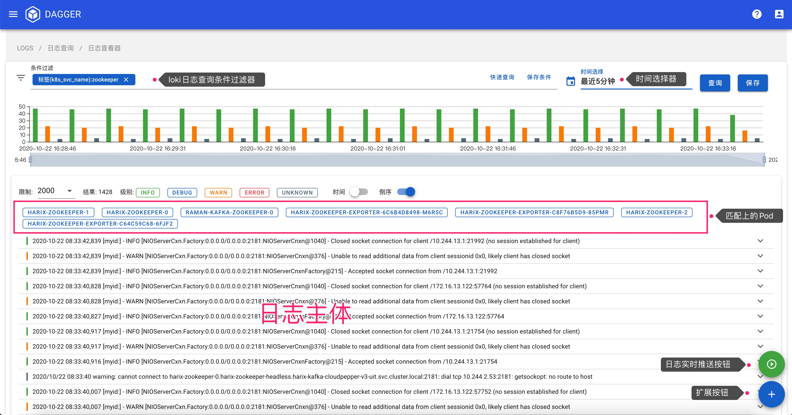

### 查询日志

如果 dagger 和 loki 对接成功后，点击条件过滤栏会得到 loki 当前的所有日志流的 label，点击某一个 label 后会自动加载出对应的值

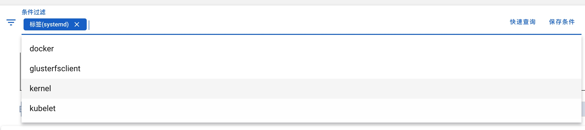

### 过滤日志

对日志进行过滤可以直接在条件过滤栏中填入要过滤的`字符串`或者`正则表达式`,如果有多个管道匹配项则重复填入即可

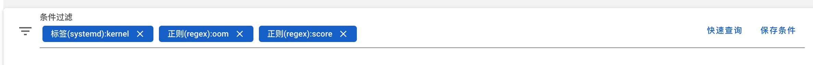

### 快速查询

对于需要经常查看的日志 label 组合，点击`保存条件`就可以存储在个人的查询记录里面，如果需要快速定位日志，点击`快速查询`会弹出过去保存的 label 组合，选择自己需要的即可

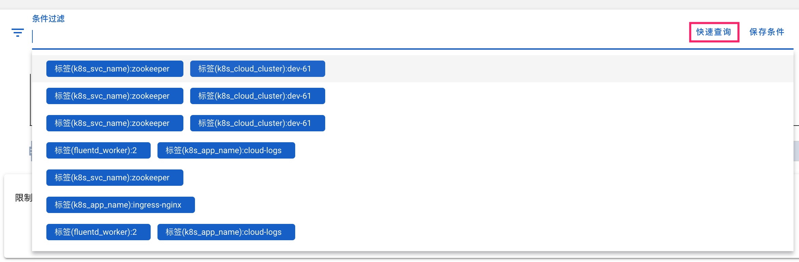

### 查询时间

dagger 默认查询时间为最近 5 分钟，需要自定义时间，点击`时间选择`会弹出时间选择器。提供`精细时间`和`最近时间`两种方式选择方式

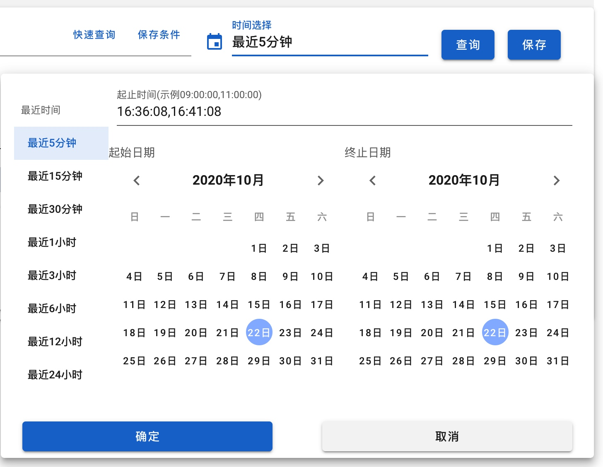

### 日志输出限制

Dagger 默认对日志查询限制 2000 行限制，当前支持 500、1000、2000、5000 和 10000 行的日志输出。更大的日志输出行，我们建议结合日志过滤功能使用。

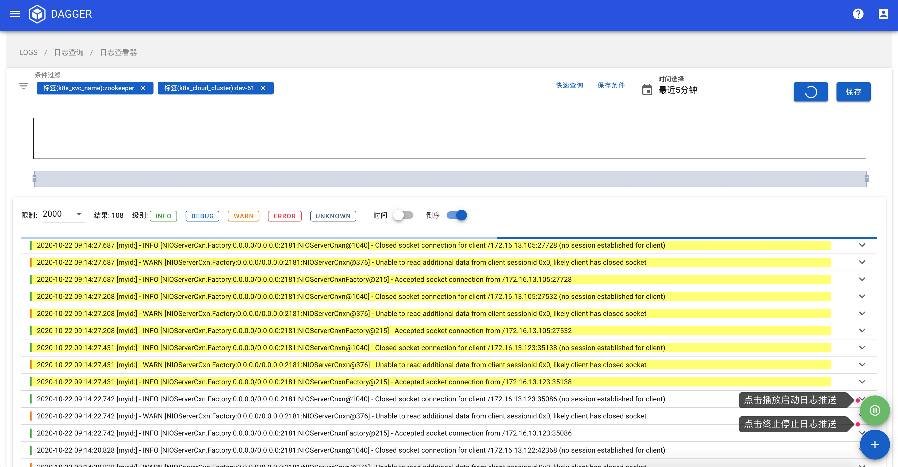

### 过滤日志级别

当前 dagger 默认支持五种日志级别的过滤，`INFO`,`DEBUG`,`WARN`,`ERROR`和`UNKNOWN`，单机打它们任何一个按钮即可切换到日志级别的视图。


他们的默认过滤规则如下：

- INFO： [I]、[info]、【info】、info、level=info
- DEBUG： [D]、[deug]、【debug】、debug、level=debug
- WARN： [W]、[warn]、[warning]、【warn】、【warning】、warn、warning、level=warn、level=warning
- ERROR： [E]、[error]、【error】、error、level=error
- UNKNOWN: 未匹配到的日志

> 以上过滤均不区分大小写

### 日志实时推送

当选择好日志的过滤规则后，点击界面右下角的绿色播放按钮即可打开日志实时推送功能，默认最新日志会染成黄色


### 日志下载

dagger 提供两种方式保留当前查询的日志

- 直接下载日志

点击又下角`+`号会弹出下载按钮，直接下载即可

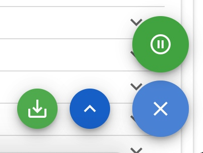

- 将日志保存在 dagger

点击右上角`保存`即可将查询的日志的快照保存在 dagger 当中

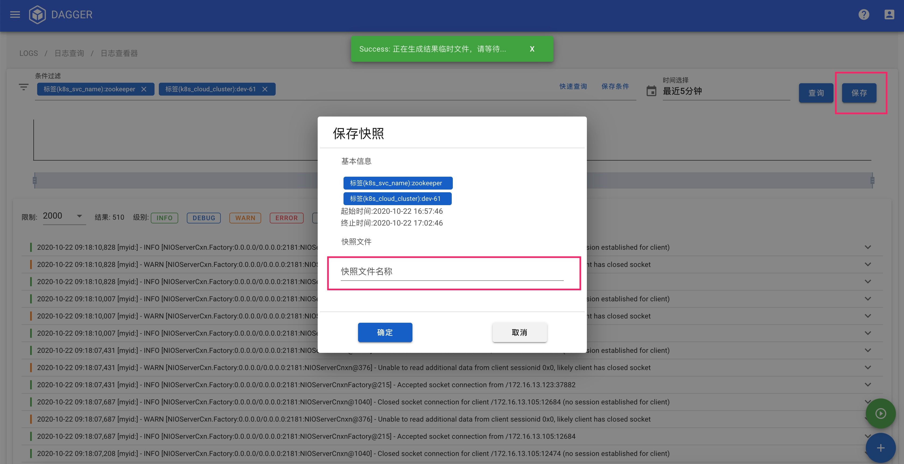

### 查询历史

点击界面左上角的侧边栏管理器，可以进入`查询历史`界面，这里面保存用户的历次查询记录，你可以在这个界面点击查询快速切到你想查看的日志流当中。

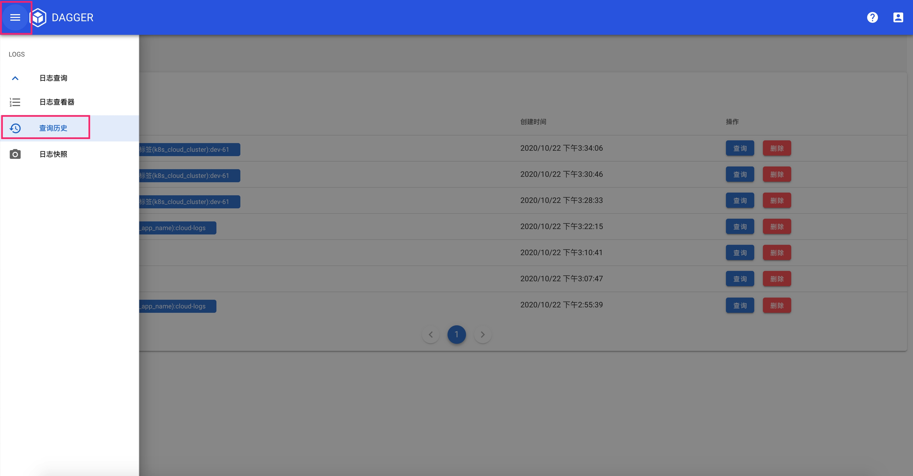

### 日志快照

点击界面左上角的侧边栏管理器，可以进入`日志快照`界面，这里面保存了用户的日志快照。这里面你可以进行查看快照、快照下载、删除快照等管理工作。

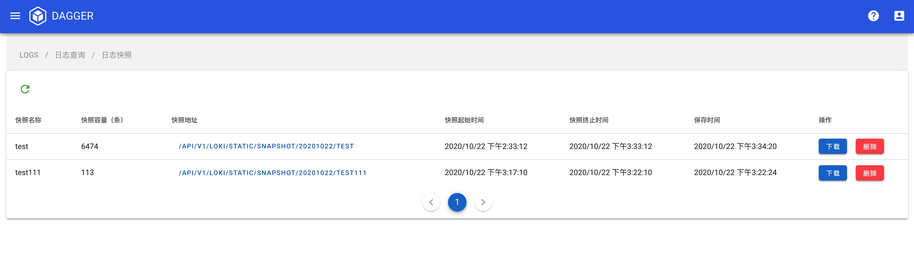
